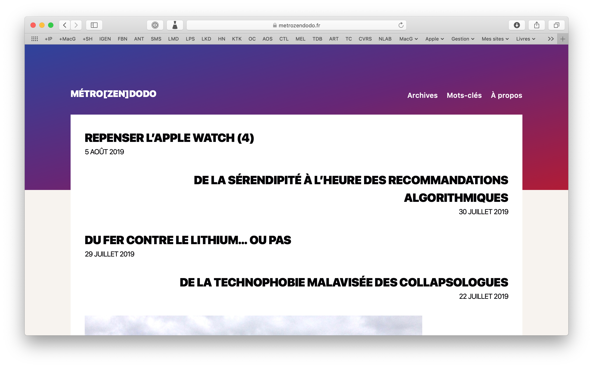
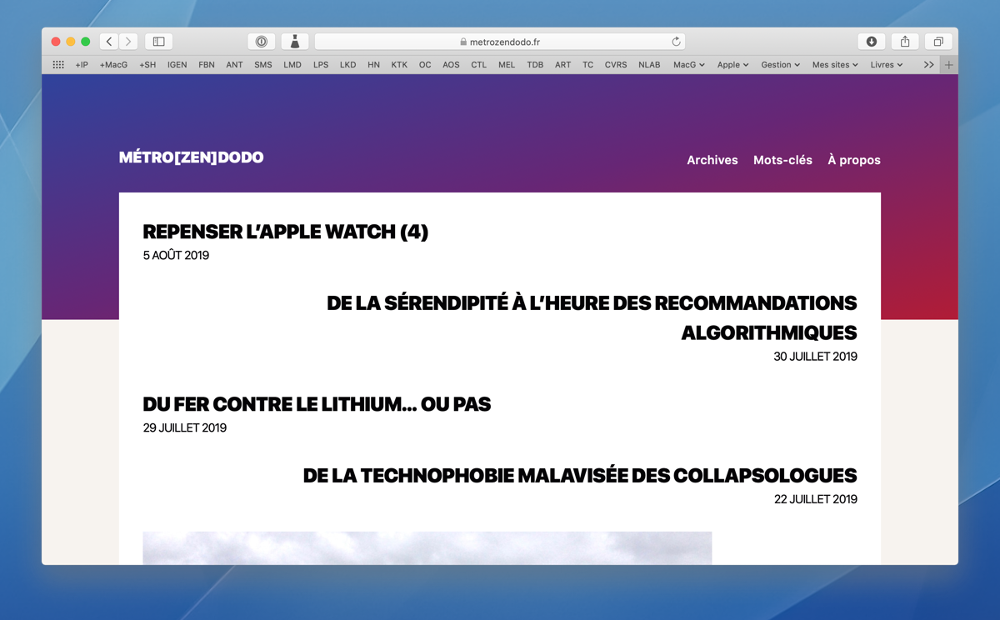

# WindowStitcher

WindowStitcher takes a screen capture of a window and centres it over a specified background. This script should be useful for anyone writing about apps.

## Example

WindowStitcher takes this window capture (PNG with transparency mask):

And this magnificent wallpaper:

To make this composite:

The padding around the window is user-configurable. The window is centred over the wallpaper, but the position will be user-configurable in a future release. The width of the output file is fixed at 1200px (plus twice the specified padding), but will be user-configurable in a future release.

## Usage

	python3 window-stitcher.py [-h] [-p PADDING] background window
	
## Licence

EUPL 1.2.